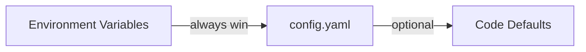

## Good defaults

GoModel uses a good defaults philosophy. This means that the default settings should be enough to use it.

## How to override the default settings?

We use a three-layer configuration pipeline. Every setting has a sensible default, so you can start the server with zero configuration.

{/* Environment Variables (always win) → config.yaml (optional) → Code Defaults */}



<Tip>
  As GoModel works out of the box with no configuration files, you can try it in
  a minute.

Start here: [Quick Start](/getting-started/quickstart)

</Tip>

GoModel automatically discovers providers from well-known environment variables.

## Configuration Methods

### 1. Environment Variables

The most common way to configure GoModel. Set any of the variables below to override defaults.

#### Server

| Variable             | Description                                           | Default                |
| -------------------- | ----------------------------------------------------- | ---------------------- |
| `PORT`               | HTTP server port                                      | `8080`                 |
| `BASE_PATH`          | Mount path prefix, for example `/g`                   | `/`                    |
| `GOMODEL_MASTER_KEY` | Authentication key for securing the gateway           | _(empty, unsafe mode)_ |
| `BODY_SIZE_LIMIT`    | Max request body size (e.g., `10M`, `1024K`, `500KB`) | _(no limit)_           |
| `USER_PATH_HEADER`   | Header used to read/write request `user_path` values  | `X-GoModel-User-Path`  |

#### Logging

Runtime logger output. For the persisted API audit trail (request/response
bodies, headers), see [Audit Logging](#audit-logging) below.

| Variable     | Description                                                                                                                                                                       | Default              |
| ------------ | --------------------------------------------------------------------------------------------------------------------------------------------------------------------------------- | -------------------- |
| `LOG_FORMAT` | `text` for colorized human output, `json` for structured logs. Unset auto-detects: text on a TTY, JSON otherwise. Force `json` in production / CloudWatch / Datadog / GCP setups. | _(auto-detect)_      |
| `LOG_LEVEL`  | Minimum log level: `debug`, `info`, `warn`, `error`. Aliases `dbg`, `inf`, `warning`, `err` are also accepted.                                                                    | `info`               |

#### Cache

| Variable            | Description                       | Default          |
| ------------------- | --------------------------------- | ---------------- |
| `GOMODEL_CACHE_DIR` | Directory for local cache files   | `.cache`         |
| `REDIS_URL`         | Redis connection URL              | _(empty)_        |
| `REDIS_KEY_MODELS`     | Redis key for model cache           | `gomodel:models`    |
| `REDIS_KEY_RESPONSES`  | Redis key for response cache        | `gomodel:response:` |
| `REDIS_TTL_MODELS`     | TTL in seconds for model cache      | `86400` (24h)    |
| `REDIS_TTL_RESPONSES`  | TTL in seconds for response cache   | `3600` (1h)      |

<Tip>
  See [Cache](/features/cache) for exact-cache behavior, response headers,
  analytics endpoints, and the note that `user_path` alone does not partition
  the exact cache.
</Tip>

#### Storage

Storage is shared by audit logging, usage tracking, and future features like IAM.

| Variable             | Description                                   | Default           |
| -------------------- | --------------------------------------------- | ----------------- |
| `STORAGE_TYPE`       | Backend: `sqlite`, `postgresql`, or `mongodb` | `sqlite`          |
| `SQLITE_PATH`        | SQLite database file path                     | `data/gomodel.db` |
| `POSTGRES_URL`       | PostgreSQL connection string                  | _(empty)_         |
| `POSTGRES_MAX_CONNS` | PostgreSQL connection pool size               | `10`              |
| `MONGODB_URL`        | MongoDB connection string; a database named in its path is used | _(empty)_ |
| `MONGODB_DATABASE`   | MongoDB database name; overrides the URL path | `gomodel`         |

#### Audit Logging

| Variable                          | Description                                | Default |
| --------------------------------- | ------------------------------------------ | ------- |
| `LOGGING_ENABLED`                 | Enable audit logging                       | `false` |
| `LOGGING_LOG_BODIES`              | Log request/response bodies                | `true`  |
| `LOGGING_LOG_AUDIO_BODIES`        | Log audio endpoint inputs/outputs          | `false` |
| `LOGGING_LOG_HEADERS`             | Log headers (sensitive ones auto-redacted) | `true`  |
| `LOGGING_ONLY_MODEL_INTERACTIONS` | Only log AI model endpoints                | `true`  |
| `LOGGING_BUFFER_SIZE`             | In-memory buffer before flush              | `1000`  |
| `LOGGING_FLUSH_INTERVAL`          | Flush interval in seconds                  | `5`     |
| `LOGGING_RETENTION_DAYS`          | Auto-delete after N days (0 = forever)     | `30`    |

<Warning>
  When `LOGGING_LOG_BODIES` is enabled, request and response bodies are stored
  in full. These may contain sensitive data such as PII or API keys embedded in
  prompts.
</Warning>

<Note>
  `LOGGING_LOG_AUDIO_BODIES` refines `LOGGING_LOG_BODIES` for audio endpoints —
  it has no effect unless body logging is enabled. With both on, `/v1/audio/speech`
  stores its text input and the generated audio (base64, capped at 8 MB) so the
  dashboard can play it back, and `/v1/audio/transcriptions` stores the uploaded
  audio (base64, capped at 8 MB, also playable) plus its upload metadata. It
  defaults to `false` because audio payloads are
  large and grow the audit store quickly. When body logging is on but this is off,
  audio bodies (the speech response and the transcription upload, which keeps its
  metadata) are recorded as a lightweight `{__audio__, content_type, bytes, stored: false}`
  placeholder; when body logging is off, no audio body is stored at all.
</Note>

#### Token Usage Tracking

| Variable                       | Description                                    | Default |
| ------------------------------ | ---------------------------------------------- | ------- |
| `USAGE_ENABLED`                | Enable token usage tracking                    | `true`  |
| `USAGE_PRICING_RECALCULATION_ENABLED` | Enable the admin usage pricing recalculation action when supported | `true` |
| `ENFORCE_RETURNING_USAGE_DATA` | Auto-add `include_usage` to streaming requests | `true`  |
| `USAGE_BUFFER_SIZE`            | In-memory buffer before flush                  | `1000`  |
| `USAGE_FLUSH_INTERVAL`         | Flush interval in seconds                      | `5`     |
| `USAGE_RETENTION_DAYS`         | Auto-delete after N days (0 = forever)         | `90`    |

#### Budgets

Budgets use tracked usage cost records. If usage tracking is disabled, GoModel
starts with budget management disabled and logs a warning.

| Variable            | Description                                             | Default |
| ------------------- | ------------------------------------------------------- | ------- |
| `BUDGETS_ENABLED`   | Enable budget management and workflow budget checks when usage tracking is enabled | `true`  |
| `SET_BUDGET_<PATH>` | Seed budget limits for a user path, such as `daily=10` | _(empty)_ |

`SET_BUDGET_<PATH>` supports the standard periods `hourly`, `daily`, `weekly`,
and `monthly`. The `<PATH>` suffix is lowercased; use double underscores
(`__`) between path segments, while single underscores stay inside a segment.
For example, `SET_BUDGET_TEAM__ALPHA__SERVICE="daily=10"` configures
`/team/alpha/service`, and `SET_BUDGET_TEAM_ALPHA="daily=10"` configures
`/team_alpha`. This differs from provider `<SUFFIX>` variables below, which
convert underscores to hyphens in provider names.

`SET_BUDGET_="monthly=500"` means a literal environment variable named
`SET_BUDGET_`, which configures the root path `/`. POSIX permits that name, but
some shells and orchestrators, including some Kubernetes validators, may reject
it. Use YAML or the dashboard when your environment cannot set it.

Migration note: budget management depends on usage tracking. If
`USAGE_ENABLED=false`, GoModel starts with budgets disabled and logs a warning,
even when `BUDGETS_ENABLED=true`. Set both `USAGE_ENABLED=true` and
`BUDGETS_ENABLED=true` to enforce budgets.

See [Budgets](/features/budgets) for YAML examples, periods, matching, and
workflow enforcement.

#### Metrics

<Note>
  Prometheus support is **experimental**. See the
  [Prometheus Metrics guide](/guides/prometheus-metrics) for details.
</Note>

| Variable           | Description                              | Default    |
| ------------------ | ---------------------------------------- | ---------- |
| `METRICS_ENABLED`  | Enable Prometheus metrics (experimental) | `false`    |
| `METRICS_ENDPOINT` | HTTP path for metrics                    | `/metrics` |

#### Admin

| Variable                              | Description                                      | Default |
| ------------------------------------- | ------------------------------------------------ | ------- |
| `ADMIN_ENDPOINTS_ENABLED`             | Enable the admin REST API                        | `true`  |
| `ADMIN_UI_ENABLED`                    | Enable the admin dashboard UI                    | `true`  |
| `DASHBOARD_LIVE_LOGS_ENABLED`         | Stream realtime dashboard audit/usage previews   | `true`  |
| `DASHBOARD_LIVE_LOGS_BUFFER_SIZE`     | In-memory replay window for live dashboard events | `10000` |
| `DASHBOARD_LIVE_LOGS_REPLAY_LIMIT`    | Max events replayed to one reconnecting client   | `1000`  |
| `DASHBOARD_LIVE_LOGS_HEARTBEAT_SECONDS` | Idle stream heartbeat interval in seconds      | `15`    |

Live dashboard logs are compact previews for the Audit Logs and Usage pages.
They update rows before the async database flush finishes. The stored audit and
usage tables remain the source of truth; if a browser reconnects with a cursor
outside the replay window, the dashboard reloads from the normal REST APIs.

#### HTTP Client

These control timeouts for upstream API requests to LLM providers.

| Variable                       | Description                                  | Default        |
| ------------------------------ | -------------------------------------------- | -------------- |
| `HTTP_TIMEOUT`                 | Overall request timeout in seconds           | `600` (10 min) |
| `HTTP_RESPONSE_HEADER_TIMEOUT` | Time to wait for response headers in seconds | `600` (10 min) |

#### Provider API Keys

Set these to automatically register providers. No YAML configuration required.

| Variable             | Provider                                           |
| -------------------- | -------------------------------------------------- |
| `OPENAI_API_KEY`     | OpenAI                                             |
| `ANTHROPIC_API_KEY`  | Anthropic                                          |
| `GEMINI_API_KEY`     | Google Gemini                                      |
| `DEEPSEEK_API_KEY`   | DeepSeek                                           |
| `OPENROUTER_API_KEY` | OpenRouter                                         |
| `ZAI_API_KEY`        | Z.ai                                               |
| `XAI_API_KEY`        | xAI (Grok)                                         |
| `GROQ_API_KEY`       | Groq                                               |
| `AZURE_API_KEY`      | Azure OpenAI (`AZURE_BASE_URL` also required)     |
| `ORACLE_API_KEY`     | Oracle GenAI (`ORACLE_BASE_URL` also required)    |
| `OLLAMA_BASE_URL`    | Ollama (no API key needed)                        |
| `VLLM_BASE_URL`      | vLLM (no API key needed unless upstream requires) |

Most providers can use a custom base URL via `<PROVIDER>_BASE_URL` (for example `OPENAI_BASE_URL`). DeepSeek defaults to `https://api.deepseek.com`; set `DEEPSEEK_BASE_URL` only for a compatible proxy or alternate DeepSeek endpoint. OpenRouter defaults to `https://openrouter.ai/api/v1` and can be overridden with `OPENROUTER_BASE_URL`. Z.ai defaults to `https://api.z.ai/api/paas/v4`; set `ZAI_BASE_URL=https://api.z.ai/api/coding/paas/v4` for the GLM Coding Plan endpoint. vLLM defaults to `http://localhost:8000/v1` when `VLLM_API_KEY` is set, but keyless deployments should set `VLLM_BASE_URL` explicitly to register the provider. Azure uses `AZURE_BASE_URL` for its deployment base URL and accepts an optional `AZURE_API_VERSION` override; otherwise it defaults to `2024-10-21`. Oracle requires `ORACLE_BASE_URL` because its OpenAI-compatible endpoint is region-specific.

Kimi forwards inbound request headers to the upstream by default. For any provider that supports per-request header handling, override that behavior with `<PROVIDER>_PASSTHROUGH_USER_HEADERS=true|false`. For example, `KIMI_PASSTHROUGH_USER_HEADERS=false` disables header passthrough for Kimi without editing the YAML file, which is useful when an upstream rejects inherited `Authorization`, tracing, or routing headers. The env var accepts `true`, `false`, `1`, `0`, `yes`, or `no` (case-insensitive); an empty or invalid value falls back to the provider's default (currently `true` for Kimi, `false` for every other provider).

Every provider type also accepts a comma-separated configured model list via
`<PROVIDER>_MODELS`, for example `OPENROUTER_MODELS`, `ORACLE_MODELS`,
`AZURE_MODELS`, or `VLLM_MODELS`. By default,
`CONFIGURED_PROVIDER_MODELS_MODE=fallback` uses configured lists only when
upstream `/models` fails, returns nil, or returns an empty list. Set
`CONFIGURED_PROVIDER_MODELS_MODE=allowlist` to expose only configured models for
providers that define a list and skip their upstream `/models` calls. YAML
`providers.<name>.models` provides the same model-list input for named provider
blocks.

For OpenRouter, GoModel also sends default attribution headers unless the request already sets them. Override those defaults with `OPENROUTER_SITE_URL` and `OPENROUTER_APP_NAME`.

### 2. `.env` File

GoModel automatically loads a `.env` file from the working directory at startup. This is convenient for local development.

```bash
# .env
PORT=3000
BASE_PATH=/g
OPENAI_API_KEY=sk-...
ANTHROPIC_API_KEY=sk-ant-...
```

Copy `.env.template` to `.env` and uncomment the values you need:

```bash
cp .env.template .env
```

<Note>
  Real environment variables always override values from the `.env` file. The
  `.env` file is only loaded if it exists — missing it is not an error.
</Note>

### 3. Configuration File (YAML)

For more complex setups, you can use an optional YAML configuration file. GoModel looks for it in two locations (in order):

1. `config/config.yaml`
2. `config.yaml`

If you are deciding whether you need YAML at all, see
[config.yaml](/advanced/config-yaml).

To get started, copy the example:

```bash
cp config/config.example.yaml config/config.yaml
```

Then uncomment and edit the settings you want to change:

```yaml
server:
  port: "3000"
  base_path: "/g"
  user_path_header: "X-GoModel-User-Path"
  master_key: "my-secret-key"

cache:
  model:
    redis:
      url: "redis://my-redis:6379"

budgets:
  enabled: true
  user_paths:
    - path: "/team/alpha"
      limits:
        - period: "daily"
          amount: 10.00
        - period: "weekly"
          amount: 50.00

providers:
  openai:
    type: openai
    api_key: "sk-..."

  anthropic:
    type: anthropic
    api_key: "sk-ant-..."

  # Custom OpenAI-compatible provider
  my-custom-llm:
    type: openai
    base_url: "https://api.example.com/v1"
    api_key: "..."
```

The YAML file supports environment variable expansion using `${VAR}` and `${VAR:-default}` syntax:

```yaml
server:
  port: "${PORT:-8080}"

providers:
  openai:
    type: openai
    api_key: "${OPENAI_API_KEY}"
```

<Tip>
  The YAML file is entirely optional. Any setting you can put in YAML can also
  be set via environment variables. Use YAML when you need per-provider
  resilience overrides, generated provider names are not enough, or you prefer
  a structured config file.
</Tip>

## Provider Configuration

### Auto-Discovery from Environment Variables

The simplest way to add providers. GoModel checks for well-known API key environment variables and automatically registers providers:

```bash
export OPENAI_API_KEY="sk-..."      # Registers "openai" provider
export ANTHROPIC_API_KEY="sk-ant-..." # Registers "anthropic" provider
export GEMINI_API_KEY="..."          # Registers "gemini" provider
export DEEPSEEK_API_KEY="..."        # Registers "deepseek" provider
export XAI_API_KEY="..."             # Registers "xai" provider
export GROQ_API_KEY="gsk_..."        # Registers "groq" provider
export OPENROUTER_API_KEY="sk-or-..." # Registers "openrouter" provider
export ZAI_API_KEY="..."             # Registers "zai" provider
# Optional: export ZAI_BASE_URL="https://api.z.ai/api/coding/paas/v4"
export AZURE_API_KEY="..."           # Registers "azure" provider when paired with AZURE_BASE_URL
export AZURE_BASE_URL="https://your-resource.openai.azure.com/openai/deployments/your-deployment"
export ORACLE_API_KEY="..."          # Registers "oracle" provider when paired with ORACLE_BASE_URL
export ORACLE_BASE_URL="https://inference.generativeai.us-chicago-1.oci.oraclecloud.com/20231130/actions/v1"
export ORACLE_MODELS="openai.gpt-oss-120b,xai.grok-3" # Optional configured model list
export OPENROUTER_MODELS="openai/gpt-oss-120b,anthropic/claude-sonnet-4"
export CONFIGURED_PROVIDER_MODELS_MODE="fallback" # fallback or allowlist
export OLLAMA_BASE_URL="http://localhost:11434/v1" # Registers "ollama" provider
export VLLM_BASE_URL="http://localhost:8000/v1" # Registers keyless "vllm" provider
# Optional: export VLLM_API_KEY="token-abc123"
```

Use suffixed variables to register more than one instance of the same provider
type without YAML. GoModel normalizes the suffix to lowercase and converts
underscores to hyphens in the configured provider name:

```bash
export OPENAI_EAST_API_KEY="sk-..." # Registers "openai-east", type "openai"
export OPENAI_EAST_BASE_URL="https://east.example.com/v1"

export OPENAI_WEST_API_KEY="sk-..." # Registers "openai-west", type "openai"
export OPENAI_WEST_BASE_URL="https://west.example.com/v1"
```

The same pattern works for every registered provider type:
`<PROVIDER>_<SUFFIX>_API_KEY`, `<PROVIDER>_<SUFFIX>_BASE_URL`, and
`<PROVIDER>_<SUFFIX>_MODELS`. Azure also supports
`<PROVIDER>_<SUFFIX>_API_VERSION`. Azure and Oracle still require their
suffixed `BASE_URL` values because their endpoints are deployment- or
region-specific.

Google Vertex AI uses the `VERTEX_*` prefix and follows the same
suffix-to-name rule as other providers:

```bash
export VERTEX_PROJECT="prod-ai"
export VERTEX_LOCATION="us-central1" # Registers "vertex", type "vertex"

export VERTEX_US_PROJECT="prod-ai"
export VERTEX_US_LOCATION="us-central1" # Registers "vertex-us", type "vertex"
```

### YAML Provider Blocks

For more control (custom names, per-provider resilience, or larger structured
settings), use the YAML file:

```yaml
models:
  # fallback is the default. Use allowlist when configured provider model lists
  # should hide upstream models and skip upstream /models calls.
  configured_provider_models_mode: fallback

providers:
  # Override OpenAI base URL
  openai:
    type: openai
    api_key: "sk-..."
    base_url: "https://my-proxy.example.com/v1"

  # Add a second OpenAI-compatible endpoint
  azure:
    type: azure
    base_url: "https://my-resource.openai.azure.com/openai/deployments/gpt-4"
    api_key: "..."
    api_version: "2024-10-21"

  # Add Oracle's OpenAI-compatible endpoint
  oracle:
    type: oracle
    base_url: "https://inference.generativeai.us-chicago-1.oci.oraclecloud.com/20231130/actions/v1"
    api_key: "..."
    models:
      - openai.gpt-oss-120b
      - xai.grok-3

  # Add DeepSeek. GoModel translates /v1/responses to DeepSeek chat completions.
  deepseek:
    type: deepseek
    base_url: "https://api.deepseek.com"
    api_key: "..."

  # Add a vLLM OpenAI-compatible server
  vllm:
    type: vllm
    base_url: "http://localhost:8000/v1"
    # api_key is optional; set it only when vllm serve uses --api-key.
    # api_key: "token-abc123"

  # Configure a model list for fallback or allowlist mode
  gemini:
    type: gemini
    api_key: "..."
    models:
      - gemini-2.0-flash
      - gemini-1.5-pro

  # Add Google Vertex AI. Project and location are required.
  vertex:
    type: vertex
    auth_type: gcp_adc
    vertex_project: "prod-ai"
    vertex_location: "us-central1"
    api_mode: native
    models:
      - google/gemini-2.5-flash
```

<Note>
  `models:` works for every provider block. In fallback mode it is a safety net
  when upstream `/models` is unavailable or empty. In allowlist mode it becomes
  the exposed inventory for that provider and skips upstream `/models`. For Oracle GenAI, see the [Oracle GenAI
  guide](/providers/oracle) for the required OCI policy and a tested configuration.
</Note>

#### Per-Provider Header Customization (YAML)

YAML provider blocks also accept two optional header fields, useful when you
need to override or filter headers sent to a specific upstream. Both apply per
provider block, so other providers in the same config keep their default
behavior:

| Field | Type | Description |
| --- | --- | --- |
| `custom_headers` | map<string,string> | Static headers added to every outbound request for that provider (for example `X-Trace-Source: "gomodel"`). |
| `passthrough_user_headers` | bool | Whether to forward inbound request headers to the upstream provider. Default `false` for all providers except Kimi, which defaults to `true`. |

`custom_headers` is YAML-only — it has no environment-variable equivalent.
`passthrough_user_headers` defaults can also be toggled from the environment
with `<PROVIDER>_PASSTHROUGH_USER_HEADERS=true|false` (see the per-provider
notes under `### Auto-Discovery from Environment Variables` above); the env var
wins over the YAML value.

Example — Kimi with no inbound headers, only the static `X-Trace-Source`:

```yaml
providers:
  kimi:
    type: kimi
    api_key: "${KIMI_API_KEY}"
    passthrough_user_headers: false
    custom_headers:
      X-Trace-Source: "gomodel"
```

See the [Kimi provider guide](/providers/kimi) for the full skip list and
additional examples.

### Ollama (Local Models)

Ollama does not require an API key. Set the base URL to enable it:

```bash
export OLLAMA_BASE_URL="http://localhost:11434/v1"
```

Or in YAML:

```yaml
providers:
  ollama:
    type: ollama
    base_url: "http://localhost:11434/v1"
```

### vLLM

vLLM uses its OpenAI-compatible `/v1` API. In Docker, set `VLLM_BASE_URL` to
register a keyless vLLM server:

```bash
docker run --rm -p 8080:8080 \
  -e GOMODEL_MASTER_KEY="change-me" \
  -e VLLM_BASE_URL="http://host.docker.internal:8000/v1" \
  enterpilot/gomodel
```

If the upstream server was started with `vllm serve ... --api-key token-abc123`,
also set:

```bash
docker run --rm -p 8080:8080 \
  -e GOMODEL_MASTER_KEY="change-me" \
  -e VLLM_BASE_URL="http://host.docker.internal:8000/v1" \
  -e VLLM_API_KEY="token-abc123" \
  enterpilot/gomodel
```

You can also register more than one vLLM instance without YAML:

```bash
docker run --rm -p 8080:8080 \
  -e GOMODEL_MASTER_KEY="change-me" \
  -e VLLM_BASE_URL="http://host.docker.internal:8000/v1" \
  -e VLLM_TEST_BASE_URL="http://host.docker.internal:8000/v1" \
  enterpilot/gomodel
```

This registers providers `vllm` and `vllm-test`. Use YAML only when the
generated provider names are not enough or you need a larger structured block.

## Provider Behavior Notes

### Anthropic `max_tokens` default

Anthropic requires `max_tokens` on every `/v1/messages` request. If a client
omits it, GoModel injects a fallback so the request still succeeds. OpenAI and
Gemini treat the field as optional and GoModel does not inject a default for
them.

| Variable                       | Description                                       | Default |
| ------------------------------ | ------------------------------------------------- | ------- |
| `ANTHROPIC_DEFAULT_MAX_TOKENS` | Value injected when the caller omits `max_tokens` | `4096`  |

Raise this for newer models that routinely produce longer outputs (Sonnet 4.6,
Opus 4.7). Setting `max_tokens` explicitly on a request always wins over the
env-driven default. Invalid or non-positive values fall back to `4096`.
